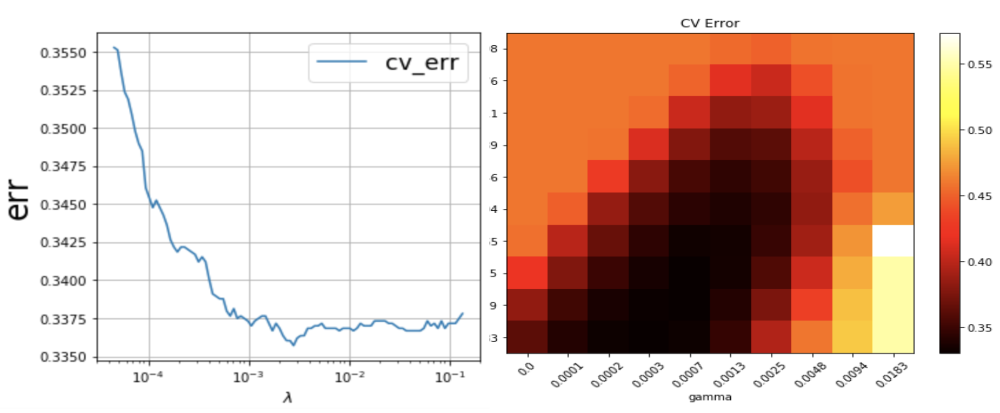
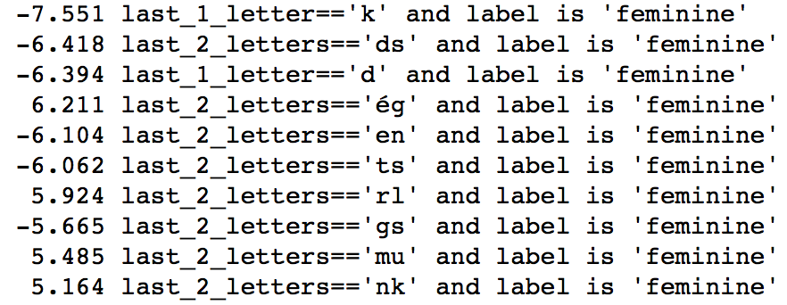
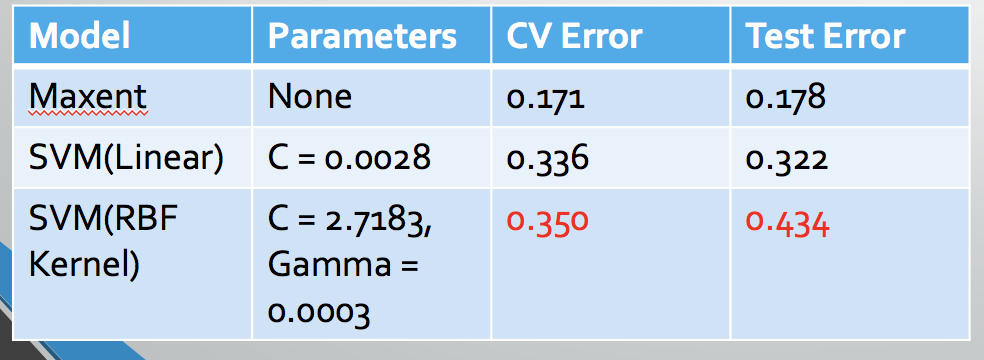

# A Cognitive Model for Gender Assignment of French Nouns

<p align="center">
  
</p>

Term: Spring 2018, Columbia University
+ Student: Yiran Jiang
+ Instructor: Chong Li

+ This project paper focuses on the application of Convex Optimization tools to solve the Machine Learning problems in the field of cognitive science.
+ Unlike English, Gender is an important attribute for French Nouns. The assignment of gender as a french native speaker or those who study french as a second language reveals their cognition of the inherent structure of the language.
+ In this paper, we use Maximum Entropy Model and Support Vector Machine with the support of a shallow Neural Network model Word2Vec to model the process of assigning gender to certain french nouns.
Experiments of such cognitive model were run on french lexical database and Corpus, both yield relatively high accuracy, proving the validity of the model.
+ After comparing the result, we conclude the validity of the model, and discuss the contributions and potential improve- ment of similar cognitive models.

+ The reproduction of our result is available by running the main.py in /doc.

+ Following are some of our training result: 
+ 
+ 
+ 


Following [suggestions](http://nicercode.github.io/blog/2013-04-05-projects/) by [RICH FITZJOHN](http://nicercode.github.io/about/#Team) (@richfitz). This folder is orgarnized as follows.

```
proj/
├── lib/
├── data/
├── doc/
└── fig/
```
